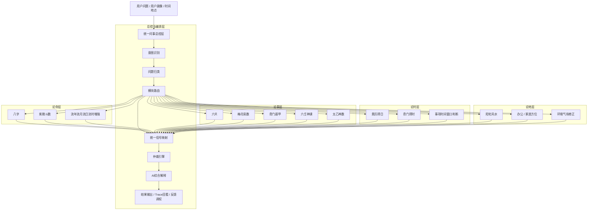

# 玄学系统集成线路图

> 文档状态：阶段性规划文档  
> 用途：描述中长期集成方向与能力版图，不作为“当前实现事实”的唯一依据。  
> 如果你要确认当前代码真实结构，请优先查看 [ARCHITECTURE.md](./ARCHITECTURE.md)。  
> 如果你要看更细的落地拆解，请查看 [INTEGRATION_IMPLEMENTATION_PLAN.md](./INTEGRATION_IMPLEMENTATION_PLAN.md)。

本文用于说明当前系统已经覆盖的玄学能力、整体系统边界，以及下一阶段继续增强集成化时的推荐接入路线。

适用对象：

- 产品设计
- 架构设计
- 前后端协同开发
- 后续模块扩展规划

## 1. 建设目标

系统目标不是把多个术数页面简单堆叠在一起，而是建设成一个真正的综合玄学决策平台。

整体目标分为五层：

- `论命`
  用于判断人的先天底盘、长期趋势、性格结构、职业方向、关系模式
- `论事`
  用于判断具体事件的吉凶、成败、阻力、突破口、行动策略
- `论时`
  用于判断什么时间更适合推进、回避、布局、签约、出行、开业
- `论地`
  用于判断环境、方位、阳宅、办公布局、空间对人事的支持或牵制
- `集成层`
  用于把不同术数的判断统一编排、统一建模、统一仲裁、统一解释

## 2. 当前系统覆盖

按照当前代码实现，系统已经具备以下核心模块：

- `论命`
  - 四柱八字
- `论事`
  - 六爻
  - 梅花易数
  - 奇门遁甲
- `论时`
  - 黄历择日
- `基础能力`
  - 阴阳历换算
  - 干支计算
  - 节气边界处理
- `集成能力`
  - 统一问事编排
  - 模块路由
  - 统一世界模型
  - 仲裁引擎
  - AI 综合解释
  - Trace 回看
  - 反馈调权

一句话概括当前状态：

> 系统已经具备“论命 + 论事 + 论时”的基础主干，并且已经开始形成统一集成内核。

## 3. 全景集成线路图

## 4. 系统能力分层

### 4.1 论命层

定位：

- 看人的先天底盘
- 看长期趋势
- 看人生结构和阶段性变化

当前已具备：

- `八字`

推荐下一步接入：

- `紫微斗数`
- `流年 / 流月 / 流日 / 流时` 时间增强层

接入后的价值：

- 从“单命理核”升级为“命理双核”
- 避免长期判断只依赖八字单一视角
- 让人生趋势、职业方向、关系倾向的判断更稳

### 4.2 论事层

定位：

- 看某件事是否可成
- 看事件推进的阻力、助力、节奏、策略

当前已具备：

- `六爻`
- `梅花易数`
- `奇门遁甲`

推荐下一步接入：

- `六壬神课`
- `太乙神数`

接入后的价值：

- 六爻偏问事结构
- 梅花偏快速感应
- 奇门偏时空策略
- 六壬偏复杂局势推断
- 太乙偏高阶全局判断

形成多事件模型交叉验证之后，系统的“即时问事”能力会明显增强。

### 4.3 论时层

定位：

- 看什么时候适合做
- 看时间窗口、节奏、推进点、规避点

当前已具备：

- `黄历择日`

推荐下一步接入：

- `奇门择时`
- `统一时间窗口判断层`

接入后的价值：

- 择日不再只是单页查询
- 时间能力从“查吉日”升级成“跨模块时机判断”
- 可以支持签约、面试、出行、开业、谈判等实际场景

### 4.4 论地层

定位：

- 看环境与空间对人事的影响
- 看住宅、办公室、朝向、动线、工位、布局

当前状态：

- 还没有真正进入统一决策主链
- 当前仅有部分“环境修正”抽象层

推荐下一步接入：

- `阳宅风水`
- `办公 / 家居方位`
- `环境气场修正`

接入后的价值：

- 补齐“时空人”中的空间维度
- 让奇门、择日的判断不只停留在时间层
- 把用户的地点、布局、方位正式接入决策

## 5. 推荐接入顺序

为了最大化系统集成收益，推荐按以下顺序推进，而不是分散式增加零散模块。

### Phase 1：命理双核化

优先接入：

- `紫微斗数`

目标：

- 形成 `八字 + 紫微` 双命理主核
- 强化人物画像、长期趋势、关系结构、职业路径分析

原因：

- 当前系统只有一个命理主核
- 紫微补上后，系统会更像真正的综合命理平台

### Phase 2：空间层接入

优先接入：

- `阳宅风水`
- `办公 / 家居方位`

目标：

- 建立正式的“论地层”
- 把空间因素变成可计算、可解释、可回看的结构化信号

原因：

- 当前系统已经有“论命、论事、论时”的雏形
- 但“论地”缺失，会让整体系统感仍不完整

### Phase 3：事件预测增强

优先接入：

- `六壬神课`

目标：

- 提升复杂事件、博弈局势、对手意图、动态变化的判断能力

原因：

- 当前事件判断已具备三条主线
- 六壬接入后会显著增强复杂局面的交叉验证能力

### Phase 4：统一时间增强层

优先接入：

- `流年 / 流月 / 流日 / 流时`

目标：

- 把时间切片能力从独立功能升级为跨模块增强器

原因：

- 时间能力不应只是择日页面
- 应该成为八字、紫微、择日、奇门的共同增强层

### Phase 5：高阶补充层

优先接入：

- `太乙神数`
- `神煞 / 纳音 / 十二长生 / 空亡` 特征增强
- `相学 / 姓名学` 辅助入口

目标：

- 提升系统解释层厚度
- 增加高阶玩法与辅助判断维度

原因：

- 这些模块有价值
- 但优先级低于命理双核、空间层、事件层和时间增强层

## 6. 统一信号设计建议

后续无论接入什么玄学模块，都不建议直接在输出层拼文本，而应先统一映射为标准信号，再进入仲裁层。

建议统一信号域包括：

- `baseline`
  人的底盘、先天稳定度、长期承载力
- `timing`
  当前时间窗口是否适合行动
- `event`
  事件本身的推进趋势与成败概率
- `space`
  环境、方位、布局对行动的支持度
- `risk`
  当前阻力、隐患、代价、博弈压力
- `support`
  外援、资源、贵人、地利、人和
- `direction`
  更适合推进、等待、转向、回避还是布局
- `certainty`
  当前判断的稳定度与置信水平

### 建议映射原则

- 命理模块更偏 `baseline`
- 占事模块更偏 `event`
- 择时模块更偏 `timing`
- 风水模块更偏 `space`
- 最终统一由仲裁层做综合评分与建议生成

## 7. 前端全景图扩展建议

前端展示建议持续沿用“全景蓝图 + 激活节点 + 激活路径”的模式。

建议把全景图扩展为五大层：

- `输入层`
  - 用户问题
  - 出生信息
  - 时间地点
- `总控层`
  - 意图识别
  - 模块路由
  - 信号映射
- `论命层`
  - 八字
  - 紫微
- `论事层`
  - 六爻
  - 梅花
  - 奇门
  - 六壬
  - 太乙
- `论时层`
  - 择日
  - 流时增强
- `论地层`
  - 风水
  - 方位
  - 环境修正
- `集成层`
  - 世界模型
  - 仲裁引擎
  - AI 综合
  - 结果输出

展示原则：

- 灰色节点：系统具备但本次未使用
- 高亮节点：本次命中的模块与步骤
- 高亮连线：本次真实推演路径

这样可以同时体现：

- 系统架构全貌
- 当前问事实际用了什么
- 哪些能力存在但未被触发

## 8. 产品形态演进目标

### 当前阶段

多模块玄学工作台 + 统一问事编排中心

### 下一阶段

综合玄学判断平台

特征：

- 命理、问事、择时开始联动
- 有统一决策框架
- 有可回看链路

### 目标阶段

综合玄学决策操作系统

特征：

- `论命 + 论事 + 论时 + 论地` 四域打通
- 多术数统一信号建模
- 统一仲裁与权重可调
- 可解释、可追踪、可复盘、可持续增强

## 9. 一句话路线总结

推荐的系统演进路径是：

`八字单核 -> 八字+紫微双核 -> 接入风水空间层 -> 增强六壬事件层 -> 建立统一时间增强层 -> 形成论命、论事、论时、论地四域集成平台`

这条路线的重点不是持续增加零散术数页面，而是优先补齐系统最关键的结构性拼图。
